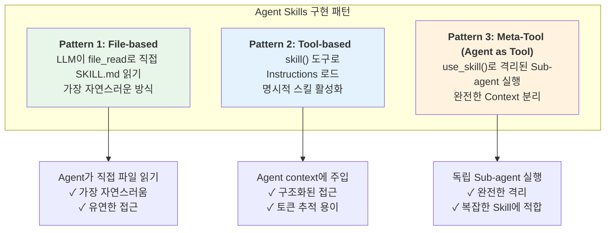
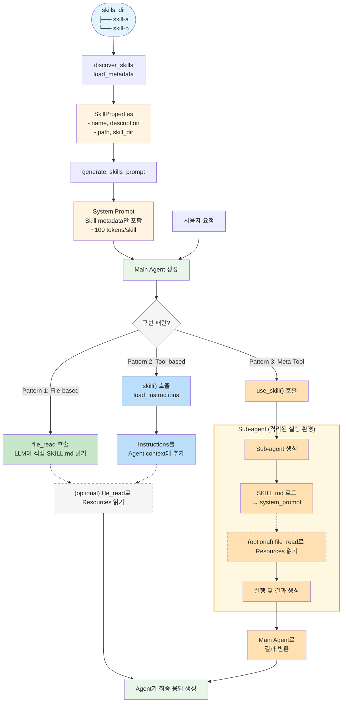

> **⚠️ This repository has been archived.** The official version is now maintained at [aws-samples/sample-strands-agents-agentskills](https://github.com/aws-samples/sample-strands-agents-agentskills).

# Agent Skills for Strands Agents SDK

**[English](README_en.md) | 한국어**

**Strands Agents SDK에서 Agent Skills 을 사용하기 위한 기본 아키텍처**

[AgentSkills.io](https://agentskills.io) 표준을 Strands Agents SDK에서 활용할 수 있도록 구현한 패키지입니다. Progressive Disclosure 원칙을 기반으로 설계된 재사용 가능하고 확장 가능한 Agent Skills 시스템을 제공합니다.

## 🎯 프로젝트 소개

### Agent Skills란?

Agent Skills는 AI Agent에게 전문화된 능력을 부여하는 모듈형 캐피빌리티입니다. 각 Skill은 특정 도메인(웹 리서치, 파일 처리 등)에 대한 전문 지식, 작업 흐름, 모범 사례를 패키징하여 일반 목적의 Agent를 도메인 전문가로 변모시킵니다.

### 왜 Agent Skills이 필요한가?

**전통적인 Tool 기반 접근법의 한계:**
- **토큰 비효율 문제**: 모든 도구의 사양을 항상 컨텍스트에 로드
- **복잡도 증가**: 도구가 많아질수록 Agent의 의사결정 복잡도 급증
- **재사용성 부족**: 전문 지식을 다른 프로젝트에 재사용하기 어려움

**Agent Skills의 해결책:**
- **Progressive Disclosure**: 필요한 정보만 필요한 시점에 로드
- **모듈화**: 독립적인 Skills로 관리하여 재사용성 향상
- **전문화**: 복잡한 다단계 작업을 하나의 Skill로 캡슐화

### 핵심 철학

이 구현체는 다음의 핵심 원칙을 따릅니다:

#### 1. 표준 준수

[AgentSkills.io](https://agentskills.io) 표준을 완전히 구현합니다:
- SKILL.md 형식 (YAML frontmatter + Markdown)
- 필수 필드: `name`, `description`
- 선택 필드: `license`, `compatibility`, `allowed-tools`, `metadata`
- 이름 검증 (kebab-case, 최대 64자)
- Progressive disclosure 패턴
- 보안 (경로 탐색 방지, 파일 크기 제한)

> SKILL에 대한 설명은 [WHAT_IS_SKILL.md](./docs/WHAT_IS_SKILL.md)를 참고하세요.

#### 2. Progressive Disclosure (점진적 공개) 구현

AgentSkills.io의 3단계 로딩 패턴을 따라 **Progressive Disclosure** 을 구현합니다. 최소한의 metadata만 먼저 로드하고, 전체 내용은 필요할 때만 로드합니다:

- **Phase 1 - Metadata (~100 tokens/skill)**: Discovery 시 Skill 이름과 description만 로드
- **Phase 2 - Instructions (<5000 tokens)**: Skill이 활성화(Activation)될 때 SKILL.md의 instructions 로드
- **Phase 3 - Resources (as needed)**: 필요할 때만 resource 파일 (`scripts/`, `references/`, `assets/`) 로드

**토큰 효율성:**

| Phase | 시점 | 내용 | 토큰 |
|-------|------|------|------|
| 1 | 시작 시 | 모든 스킬 metadata | ~100/skill |
| 2 | 활성화 시 | 단일 스킬 instructions | <5000 |
| 3 | 필요 시 | 개별 resource 파일 | 가변 |

#### 3. 보안

- **경로 검증**: 디렉토리 탐색 공격 방지
- **파일 크기 제한**: 대용량 파일 로딩 방지 (최대 10MB)
- **엄격한 검증**: Agent Skills 표준 강제
- **명확한 에러**: 실패 시 명확한 피드백

#### 4. Skills as Meta-Tools

Skill은 실행 가능한 코드가 아닙니다. Skill은:
- **프롬프트 템플릿**: 도메인 특화 instructions
- **단일 tool 패턴**: 하나의 Meta-tool이 모든 skill 관리
- **LLM 기반 선택**: Agent가 자연스럽게 적절한 skill 선택
- **Context 확장**: Skill이 전문화된 instructions를 agent context에 주입

---

## 🔑 핵심: 3가지 구현 패턴

이 패키지는 Strands Agents SDK에서 Agent Skills를 사용하기 위한 **3가지 구현 패턴**을 제공합니다:



**Pattern 1: File-based**
: LLM이 직접 파일을 읽습니다. 가장 유연하고 토큰 효율적입니다.

**Pattern 2: Tool-based**
: `skill` 도구로 instructions를 명시적으로 로드합니다. **구조화된 접근**이 필요한 경우 사용합니다.

**Pattern 3: Meta-Tool (Agent as Tool)**
: Meta-Tool 접근 방식으로, 각 Skill이 독립된 Sub-agent를 tool로 사용하여 격리 실행됩니다.
  - **완전한 격리**: 각 Skill은 독립된 Sub-agent에서 실행 (as a tool)
  - **명시적 제어**: Skill 실행이 명확하게 드러남
  - **Context 독립성**: Main agent와 Sub-agent의 context 분리
  - **도구 제한**: Skill별로 제공할 도구를 명시적으로 지정

#### 패턴 비교

| 측면 | File-based | Tool-based | Meta-Tool |
|:-----|:-----------|:-----------|:----------|
| **실행 방식** | LLM 직접 파일 읽기 | Context에 주입 | 격리된 Sub-agent |
| **Context 격리** | ❌ 공유 | ❌ 공유 | ✅ 완전 격리 |
| **유연성** | ✅ 높음 | ⚠️ 중간 | ⚠️ 낮음 |
| **토큰 추적** | ⚠️ 어려움 | ✅ 용이 | ✅ 용이 |
| **복잡도** | ✅ 낮음 | ⚠️ 중간 | ⚠️ 높음 |
| **추천 사용처** | 일반적인 경우 | 명시적 제어 필요시 | 복잡한 격리 실행 |

> 💡 **선택 가이드**
> - **Inline Mode (Pattern 1, 2)** — 단순한 워크플로우, LLM의 자연스러운 skill 선택, 경량 구현 시 선택
> - **Multi-Agent Mode (Pattern 3)** — Skill 간 격리, 명시적 제어, Skill별 도구 분리, 사용량 추적 필요 시 선택

### 3가지 패턴의 데이터 흐름



---

## 아키텍처

### 모듈 구조

```
agentskills/
├── __init__.py      # Public API
├── models.py        # SkillProperties (Phase 1 metadata)
├── parser.py        # load_metadata, load_instructions, load_resource
├── validator.py     # AgentSkills.io 표준 검증
├── discovery.py     # discover_skills (스킬 스캔)
├── tool.py          # create_skill_tool (Pattern 2: Tool-based)
├── agent_tool.py    # create_skill_agent_tool (Pattern 3: Meta-Tool)
├── prompt.py        # generate_skills_prompt (시스템 프롬프트 생성)
└── errors.py        # 예외 계층 구조
```

> 제공되는 핵심 API 정보는 [API.md](./docs/API.md)를 참고하세요.

---

## 빠른 시작

### 시스템 요구사항

- Python 3.13 이상
- Strands Agents SDK 1.0.0 이상
- Strands Agents Tools 0.2.0 이상

### 설치 방법

```bash
# requirements.txt 사용
pip install -r requirements.txt

# 패키지 설치 (개발 모드)
pip install -e .
```

### 코드 샘플

#### Pattern 1: File-based (Filesystem-Based)

```python
from agentskills import discover_skills, generate_skills_prompt
from strands import Agent
from strands_tools import file_read

# 1. Skill discovery (Phase 1: metadata만 로드)
skills = discover_skills("./skills")

# 2. System prompt 생성 (skill metadata만 포함)
base_prompt = "당신은 도움이 되는 AI 어시스턴트입니다."
skills_prompt = generate_skills_prompt(skills)
full_prompt = base_prompt + "\n\n" + skills_prompt

# 3. Agent 생성
agent = Agent(
    system_prompt=full_prompt,
    tools=[file_read],  # LLM이 필요시 SKILL.md 읽음
    model="us.anthropic.claude-sonnet-4-5-20250929-v1:0",
)

# 4. Progressive Disclosure 작동:
# Phase 1: 시스템 프롬프트에 metadata
# Phase 2: LLM이 file_read로 SKILL.md 읽기
# Phase 3: LLM이 file_read로 resources 읽기
response = await agent.stream_async("Physical AI에 대해 조사해줘")
```

#### Pattern 2: Tool-based

```python
from agentskills import discover_skills, create_skill_tool, generate_skills_prompt
from strands import Agent
from strands_tools import file_read

# 1. Skill discovery (Phase 1: metadata만 로드)
skills = discover_skills("./skills")

# 2. Skill tool 생성
skill_tool = create_skill_tool(skills, "./skills")

# 3. System prompt 생성 및 skill tool 사용하는 agent 생성
agent = Agent(
    system_prompt=base_prompt + "\n\n" + generate_skills_prompt(skills),
    tools=[skill_tool, file_read],  # skill + file_read 조합
    model="us.anthropic.claude-sonnet-4-5-20250929-v1:0",
)

# Progressive Disclosure 작동:
# Phase 1: 시스템 프롬프트에 metadata
# Phase 2: skill(skill_name="web-research")
# Phase 3: file_read로 resources 읽기
response = await agent.stream_async("Physical AI에 대해 조사해줘")
```

#### Pattern 3: Meta-Tool (Agent as Tool)

```python
from agentskills import discover_skills, create_skill_agent_tool, generate_skills_prompt
from strands import Agent
from strands_tools import file_read, file_write, shell

# 1. Skill discovery (Phase 1)
skills = discover_skills("./skills")

# 2. Meta-tool 생성 (Agent as Tool 패턴)
meta_tool = create_skill_agent_tool(
    skills,
    "./skills",
    additional_tools=[file_read, file_write, shell]  # Sub-agent에게 제공할 tools
)

# 3. System prompt 생성
base_prompt = """You are a helpful AI assistant with specialized skills.
Use the use_skill tool to execute skills in isolated sub-agents."""

full_prompt = base_prompt + "\n\n" + generate_skills_prompt(skills)

# 4. Main agent 생성
agent = Agent(
    system_prompt=full_prompt,
    tools=[meta_tool], # Sub-agent가 격리된 실행
    model="us.anthropic.claude-sonnet-4-5-20250929-v1:0",
)

# Progressive Disclosure + Meta-Tool:
# Phase 1: 시스템 프롬프트에 metadata
# Phase 2: use_skill(skill_name, request) 호출
# Phase 3: Sub-agent가 SKILL.md를 system prompt로 받아 실행
response = await agent.stream_async("Physical AI에 대해 조사해줘")
```

---

## 예제

완전한 예제는 [examples/](examples/)를 참고하세요:

- **[1-discovery_skills.py](examples/1-discovery_skills.py)** - Pattern 1: File-based 방식
  - LLM이 직접 `file_read` 도구로 SKILL.md 파일을 읽는 방식
  - Progressive Disclosure의 Phase 1-2-3을 자연스럽게 수행
  
- **[2-skill_tool_with_progressive_disclosure.py](examples/2-skill_tool_with_progressive_disclosure.py)** - Pattern 2: Tool-based 방식
  - `skill` 도구를 사용하여 instructions를 로드하는 방식
  - Phase 1-2의 토큰 사용량을 시각적으로 추적
  
- **[3-skill_agent_tool.py](examples/3-skill_agent_tool.py)** - Pattern 3: Meta-Tool 방식 (Agent as Tool)
  - 각 Skill이 격리된 Sub-agent에서 실행되는 방식
  - 완전한 context 분리 및 독립적 실행
  
- **[4-streamlit_prompt_simulation.py](examples/4-streamlit_prompt_simulation.py)** - Streamlit 기반 Progressive Disclosure 시각화
  - Phase별 토큰 사용량과 prompt 상태를 시각적으로 확인
  - Skill 활성화 및 Resource 로딩 시뮬레이션
  
- **[5-streamlit_strands_integration.py](examples/5-streamlit_strands_integration.py)** - Streamlit 기반 3가지 패턴 비교 데모
  - File-based, Tool-based, Meta-Tool 세 가지 모드 실시간 비교
  - 실제 Strands Agents SDK를 사용한 라이브 실행

자세한 예제 설명은 [examples/README.md](examples/README.md)를 참고하세요.

---

## 참고 링크

- [Agent Skills 공식 문서](https://agentskills.io)
- [Anthropic의 공개 Skills](https://github.com/anthropics/skills)
- [Claude의 Agent Skills 활용](https://platform.claude.com/docs/ko/agents-and-tools/agent-skills/overview)
- [Agent Skills Best Practices](https://platform.claude.com/docs/ko/agents-and-tools/agent-skills/best-practices)
- [Strands Agents SDK 공식 문서](https://strandsagents.com)
