# Agent Skills for Strands Agents SDK

**Strands Agents SDK를 활용한 Agent Skills 기본 아키텍처**

[AgentSkills.io](https://agentskills.io) 표준을 따라 Progressive Disclosure 원칙을 기반으로 설계된, 재사용 가능하고 확장 가능한 Agent Skills 시스템입니다.

[](LICENSE)

## 🎯 프로젝트 소개

### Agent Skills란?

Agent Skills는 AI Agent에게 전문화된 능력을 부여하는 모듈형 캐피빌리티입니다. 각 Skill은 특정 도메인(웹 리서치, 파일 처리 등)에 대한 전문 지식, 작업 흐름, 모범 사례를 패키징하여 일반 목적의 Agent를 도메인 전문가로 변모시킵니다.

### 왜 필요한가?

전통적인 Tool 기반 접근법의 한계:
- **토큰 비효율**: 모든 도구의 사양을 항상 컨텍스트에 로드
- **복잡도 증가**: 도구가 많아질수록 Agent의 의사결정 복잡도 급증
- **재사용성 부족**: 전문 지식을 다른 프로젝트에 재사용하기 어려움

Agent Skills의 해결책:
- **Progressive Disclosure**: 필요한 정보만 필요한 시점에 로드
- **모듈화**: 독립적인 Skills로 관리하여 재사용성 향상
- **전문화**: 복잡한 다단계 작업을 하나의 Skill로 캡슐화
- **격리**: Sub-agent 패턴으로 context 독립성 보장

---

## 핵심 철학

이 구현체는 다음의 핵심 원칙을 따릅니다:

### 1. Progressive Disclosure (점진적 공개)

**Progressive Disclosure** 패턴을 따릅니다. 최소한의 metadata만 먼저 로드하고, 전체 내용은 필요할 때만 로드합니다:

- **Phase 1 (Discovery)**: Skill 이름과 description만 로드 (~100 tokens/skill)
- **Phase 2 (Activation)**: Skill이 활성화될 때 전체 instructions 로드 (<5000 tokens)
- **Phase 3 (Resources)**: 필요할 때만 resource 파일 로드 (on-demand)

### 2. Skills as Meta-Tools

Skill은 실행 가능한 코드가 **아닙니다**. Skill은:
- **프롬프트 템플릿**: 도메인 특화 instructions
- **단일 tool 패턴**: 하나의 `skill` tool이 모든 skill 관리
- **LLM 기반 선택**: Agent가 자연스럽게 적절한 skill 선택
- **Context 확장**: Skill이 전문화된 instructions를 agent context에 주입

### 3. Progressive Disclosure 구현

AgentSkills.io의 3단계 로딩 패턴을 구현합니다:

- **Phase 1 - Metadata (~100 tokens)**: Discovery 시 `name`, `description`만 로드
- **Phase 2 - Instructions (<5000 tokens)**: Activation 시 SKILL.md body 로드
- **Phase 3 - Resources (as needed)**: `scripts/`, `references/`, `assets/`에서 필요한 파일만 로드

```
agentskills/
├── models.py       # SkillProperties (Phase 1 metadata)
├── parser.py       # load_metadata, load_instructions, load_resource
├── validator.py    # AgentSkills.io 표준 검증
├── discovery.py    # 스킬 디렉토리 스캔 (Phase 1)
├── tool.py         # 활성화 로직 (Phase 2)
├── prompt.py       # 시스템 프롬프트 생성
└── errors.py       # 예외 계층 구조
```

### 4. 표준 준수

[AgentSkills.io](https://agentskills.io) 표준을 완전히 구현:
- SKILL.md 형식 (YAML frontmatter + Markdown)
- 필수 필드: `name`, `description`
- 선택 필드: `license`, `compatibility`, `allowed-tools`, `metadata`
- 이름 검증 (kebab-case, 최대 64자)
- Progressive disclosure 패턴
- 보안 (경로 탐색 방지, 파일 크기 제한)


## Progressive Disclosure 작동 방식

### Phase 1: Discovery (시작 시)

```python
# 모든 Skill의 metadata만 로드
skills = discover_skills("./skills")  # ~100 tokens/skill
```

### Phase 2: Activation (필요 시)

```python
# Filesystem-based: LLM이 file_read로 자동 읽기
response = await agent.invoke_async("web-research 스킬 사용해줘")
# → LLM이 file_read로 SKILL.md 읽음

# Tool-based: skill 도구 사용
instructions = skill(skill_name="web-research")

# 또는 프로그래밍 방식으로 직접 읽기
instructions = load_instructions(skill.path)  # <5000 tokens/skill
```

### Phase 3: Resources (참조 시)

```python
# 특정 파일만 필요할 때 로드
api_docs = load_resource(skill.skill_dir, "references/api-docs.md")
```

## 토큰 효율성

Progressive Disclosure는 컨텍스트 사용을 최소화합니다:

| Phase | 시점 | 내용 | 토큰 |
|-------|------|------|------|
| 1 | 시작 시 | 모든 스킬 metadata | ~100/skill |
| 2 | 활성화 시 | 단일 스킬 instructions | <5000 |
| 3 | 필요 시 | 개별 resource 파일 | 가변 |

**10개 스킬 예시:**
- Phase 1: ~1,000 tokens (모든 스킬)
- Phase 2: ~3,000 tokens (1개 활성화)
- Phase 3: ~500 tokens (2개 resource)
- **총합: ~4,500 tokens** (vs Progressive Disclosure 없이 ~50,000 tokens!)

## 보안

내장 보안 기능:
- **경로 검증**: 디렉토리 탐색 공격 방지
- **파일 크기 제한**: 대용량 파일 로딩 방지 (최대 10MB)
- **엄격한 검증**: Agent Skills 표준 강제
- **명확한 에러**: 실패 시 명확한 피드백

## 아키텍처

### 완전한 모듈 구조

```
agentskills/
├── __init__.py      # Public API (18개 exports)
├── models.py        # SkillProperties (Phase 1 metadata)
├── parser.py        # load_metadata, load_instructions, load_resource, find_skill_md
├── validator.py     # validate, validate_metadata (표준 검증)
├── discovery.py     # discover_skills (스킬 스캔, Phase 1)
├── tool.py          # create_skill_tool (활성화, Phase 2)
├── prompt.py        # generate_skills_prompt (시스템 프롬프트 생성)
└── errors.py        # 예외 계층 구조 (5개 예외 클래스)
```

### Progressive Disclosure 데이터 흐름

```mermaid
flowchart TD
    Start([skills_dir<br/>├── skill-a<br/>└── skill-b]) --> Discover[discover_skills<br/>load_metadata]
    Discover --> Props["SkillProperties<br/>name, description, path, skill_dir<br/>~100 tokens/skill"]
    
    Props --> Prompt[generate_skills_prompt]
    Prompt --> SysPrompt["System Prompt<br/>Skill metadata만 포함<br/>~100 tokens/skill"]
    
    SysPrompt --> Agent["Agent 생성<br/>tools: skill_tool, file_read"]
    
    UserReq["사용자 요청<br/>web-research 스킬 사용해줘"] --> Agent
    
    Agent -->|"Phase 2: Activation<br/>&lt;5000 tokens"| SkillTool[skill_tool 호출]
    SkillTool --> LoadInst[load_instructions]
    LoadInst --> InstBody["SKILL.md body 반환"]
    InstBody -->|Agent context에 추가| Agent
    
    Agent -->|"Phase 3: Resources<br/>as needed"| FileRead[file_read 호출]
    FileRead --> LoadRes[load_resource]
    LoadRes --> Resources["scripts/helper.py<br/>references/api.md"]
    Resources -->|Agent context에 추가| Agent
    
    Agent --> Response[Agent가 최종 응답 생성]
    
    style Start fill:#e1f5ff
    style Props fill:#fff4e1
    style SysPrompt fill:#fff4e1
    style Agent fill:#e8f5e9
    style SkillTool fill:#f3e5f5
    style FileRead fill:#f3e5f5
    style Response fill:#e8f5e9
```



## 설치

### 시스템 요구사항

- Python 3.10 이상
- Strands Agents SDK 1.0.0 이상
- Strands Agents Tools 0.2.0 이상

### 설치 방법

```bash
# 또는 requirements.txt 사용
pip install -r requirements.txt

# 패키지 설치 (개발 모드)
pip install -e .
```

## 빠른 시작

두 가지 방식을 모두 지원하며, 각각 Progressive Disclosure를 구현합니다:

### 방식 1: Filesystem-Based (공식 권장)

LLM이 직접 파일을 읽습니다. 가장 유연하고 토큰 효율적입니다.

```python
from agentskills import discover_skills, generate_skills_prompt
from strands import Agent
from strands_tools import file_read

# 1. Skill discovery (Phase 1: metadata만 로드)
skills = discover_skills("./skills")

# 2. System prompt 생성 (skill metadata만 포함)
base_prompt = "당신은 도움이 되는 AI 어시스턴트입니다."
skills_prompt = generate_skills_prompt(skills)
full_prompt = base_prompt + "\n\n" + skills_prompt

# 3. Agent 생성
agent = Agent(
    system_prompt=full_prompt,
    tools=[file_read],  # LLM이 필요시 SKILL.md 읽음
    model="global.anthropic.claude-haiku-4-5-20251001-v1:0",
)

# 4. Progressive Disclosure 작동:
# Phase 1: 시스템 프롬프트에 metadata
# Phase 2: LLM이 file_read로 SKILL.md 읽기
# Phase 3: LLM이 file_read로 resources 읽기
response = await agent.invoke_async("양자 컴퓨팅에 대해 조사해줘")
```

### 방식 2: Tool-Based

`skill` 도구로 instructions를 로드합니다. 구조화된 접근을 선호하는 경우 사용.

```python
from agentskills import discover_skills, create_skill_tool, generate_skills_prompt
from strands import Agent
from strands_tools import file_read

skills = discover_skills("./skills")
skill_tool = create_skill_tool(skills, "./skills")

agent = Agent(
    system_prompt=base_prompt + "\n\n" + generate_skills_prompt(skills),
    tools=[skill_tool, file_read],  # skill + file_read 조합
    model="global.anthropic.claude-haiku-4-5-20251001-v1:0",
)

# Progressive Disclosure 작동:
# Phase 1: 시스템 프롬프트에 metadata
# Phase 2: skill(skill_name="web-research")
# Phase 3: file_read로 resources 읽기
response = await agent.invoke_async("양자 컴퓨팅에 대해 조사해줘")
```

**두 방식 모두 Progressive Disclosure를 완벽히 지원합니다!**

## 핵심 API

### 전체 Public API 목록

이 패키지는 다음 18개의 함수/클래스를 export합니다:

**Models:**
- `SkillProperties` - Skill 메타데이터 데이터 클래스

**Progressive Disclosure API (Phase 1-3):**
- `discover_skills()` - Phase 1: 모든 스킬의 metadata 발견
- `load_metadata()` - Phase 1: 단일 스킬의 metadata 로드
- `find_skill_md()` - SKILL.md 파일 찾기
- `load_instructions()` - Phase 2: 스킬 instructions 로드
- `load_resource()` - Phase 3: 리소스 파일 로드

**Validator:**
- `validate()` - 스킬 디렉토리 전체 검증
- `validate_metadata()` - 메타데이터만 검증

**Prompt & Tool:**
- `generate_skills_prompt()` - 시스템 프롬프트 생성
- `create_skill_tool()` - Skill 활성화 도구 생성

**Errors:**
- `SkillError` - 기본 예외 클래스
- `ParseError` - 파싱 오류
- `ValidationError` - 검증 오류
- `SkillNotFoundError` - 스킬을 찾을 수 없음
- `SkillActivationError` - 스킬 활성화 실패

### Progressive Disclosure 함수들

API는 3단계 패턴을 따릅니다:

#### Phase 1: Discovery (metadata만)

```python
from agentskills import discover_skills, load_metadata, find_skill_md
from pathlib import Path

# 모든 Skill discovery - metadata만 로드 (~100 tokens/skill)
skills = discover_skills("./skills")

# 또는 단일 스킬 metadata 읽기
skill = load_metadata(Path("./skills/web-research"))

# SKILL.md 파일 찾기
skill_md_path = find_skill_md(Path("./skills/web-research"))

for skill in skills:
    print(f"{skill.name}: {skill.description}")
    print(f"  경로: {skill.path}")
```

#### Phase 2: Activation (Instructions 로드)

```python
from agentskills import load_instructions

# Skill activation 시 instructions 로드
instructions = load_instructions(skill.path)
print(instructions)  # frontmatter 제외한 Markdown body
```

#### Phase 3: Resources (필요시 로드)

```python
from agentskills import load_resource

# 필요한 resource 파일 로드
api_docs = load_resource(skill.skill_dir, "references/api-docs.md")
helper_script = load_resource(skill.skill_dir, "scripts/helper.py")
```

### create_skill_tool(skills, skills_dir)

Progressive disclosure를 지원하는 `skill` 도구 생성 (Tool-Based 방식).

```python
from agentskills import create_skill_tool
from strands import Agent
from strands_tools import file_read

skill_tool = create_skill_tool(skills, "./skills")

# skill + file_read 조합으로 완전한 progressive disclosure
agent = Agent(
    tools=[skill_tool, file_read]
)

# LLM이 사용하는 방법:
# - skill(skill_name="web-research")  # instructions 로드
# - file_read(path="/path/to/skill/scripts/helper.py")  # resources 읽기
```

**Progressive Disclosure:**
- Phase 1: 메타데이터 (시스템 프롬프트) - ~100 tokens/skill
- Phase 2: `skill(skill_name="...")`로 instructions 로드 - <5000 tokens
- Phase 3: `file_read`로 resources 읽기 - 필요시만

### generate_skills_prompt(skills)

Skill을 LLM용 시스템 프롬프트로 변환.

```python
from agentskills import generate_skills_prompt

prompt = generate_skills_prompt(skills)
print(prompt)
```

### validate(skill_dir) / validate_metadata(metadata, skill_dir)

Agent Skills 표준에 따라 스킬 디렉토리 또는 메타데이터 검증.

```python
from agentskills import validate, validate_metadata
from pathlib import Path

# 스킬 디렉토리 전체 검증
errors = validate(Path("./skills/web-research"))
if not errors:
    print("✅ 유효한 스킬입니다")
else:
    for error in errors:
        print(f"❌ {error}")

# 메타데이터만 검증 (이미 파싱된 경우)
from agentskills import load_metadata
skill = load_metadata(Path("./skills/web-research"))
metadata = skill.to_dict()
errors = validate_metadata(metadata, Path("./skills/web-research"))
```

## SKILL.md 형식

```markdown
---
name: web-research
description: 웹 검색과 분석을 통해 포괄적인 리서치 수행
allowed-tools: WebFetch, Grep
license: MIT
---

# instructions

이 Skill을 사용하면...

## 1단계: 검색

...
```

### 필수 필드

- `name`: kebab-case 형식 (예: `web-research`)
- `description`: Skill의 기능과 사용 시기

### 선택 필드

- `license`: 스킬 라이센스
- `compatibility`: 호환성 정보
- `allowed-tools`: Skill이 사용할 수 있는 tool 패턴
- `metadata`: 사용자 정의 key-value 쌍

## 예제

완전한 예제는 [examples/](examples/)를 참고하세요:

- **[1-discovery_skills.py](examples/1-discovery_skills.py)** - Filesystem-Based 방식 기본 예제 (권장)
  - LLM이 직접 `file_read` 도구를 사용하여 SKILL.md 파일을 읽는 방식
  - Progressive Disclosure의 Phase 1-2를 자연스럽게 수행
  
- **[2-skill_tool_with_progressive_disclosure.py](examples/2-skill_tool_with_progressive_disclosure.py)** - Tool-Based 방식 예제
  - `skill` 도구를 사용하여 instructions를 로드하는 방식
  - Phase 1-2의 토큰 사용량을 시각적으로 추적
  
- **[3-strands_integration.py](examples/3-strands_integration.py)** - 완전한 Progressive Disclosure 데모
  - Phase 1 (Discovery), Phase 2 (Activation), Phase 3 (Resources) 전체 흐름 시연
  - LLM이 필요에 따라 skill과 resource를 읽는 실제 동작 확인
  
- **[4-streamlit_prompt_simulation.py](examples/4-streamlit_prompt_simulation.py)** - Streamlit 기반 Progressive Disclosure 시각화
  - Phase별 토큰 사용량과 prompt 상태를 시각적으로 확인
  - Skill 활성화 및 Resource 로딩 시뮬레이션
  
- **[5-streamlit_strands_agent.py](examples/5-streamlit_strands_agent.py)** - Streamlit 기반 실제 Agent 실행 데모
  - 실제 Strands Agents SDK를 사용한 라이브 실행
  - 질의 입력 시 Agent의 Progressive Disclosure 동작을 실시간으로 확인

자세한 예제 설명은 [examples/README.md](examples/README.md)를 참고하세요.

## 라이센스

MIT License - 자세한 내용은 LICENSE 파일 참조

## 링크

- [Agent Skills 공식 문서](https://agentskills.io)
- [Strands Agents SDK 공식 문서](https://strandsagents.com)
