# Agent Skills for Strands Agents SDK

**English | [한국어](README.md)**

**Basic architecture for using Agent Skills in Strands Agents SDK**

This package implements the [AgentSkills.io](https://agentskills.io) standard for use with Strands Agents SDK. It provides a reusable and extensible Agent Skills system designed based on the Progressive Disclosure principle.

## 🎯 Project Introduction

### What are Agent Skills?

Agent Skills are modular capabilities that give AI Agents specialized abilities. Each Skill packages domain-specific knowledge (web research, file processing, etc.), workflows, and best practices to transform a general-purpose Agent into a domain expert.

### Why are Agent Skills needed?

**Limitations of traditional tool-based approaches:**
- **Token inefficiency**: All tool specifications are always loaded into context
- **Complexity increase**: As tools increase, Agent decision complexity grows exponentially
- **Lack of reusability**: Difficult to reuse specialized knowledge in other projects

**Agent Skills solutions:**
- **Progressive Disclosure**: Load only necessary information when needed
- **Modularization**: Manage as independent Skills for improved reusability
- **Specialization**: Encapsulate complex multi-step tasks as a single Skill

### Core Philosophy

This implementation follows these core principles:

#### 1. Standard Compliance

Fully implements the [AgentSkills.io](https://agentskills.io) standard:
- SKILL.md format (YAML frontmatter + Markdown)
- Required fields: `name`, `description`
- Optional fields: `license`, `compatibility`, `allowed-tools`, `metadata`
- Name validation (kebab-case, max 64 characters)
- Progressive disclosure pattern
- Security (path traversal prevention, file size limits)

> For SKILL documentation, see [WHAT_IS_SKILL.md](./docs/WHAT_IS_SKILL.md).

#### 2. Progressive Disclosure Implementation

Implements **Progressive Disclosure** following AgentSkills.io's 3-phase loading pattern. Load minimal metadata first, and full content only when needed:

- **Phase 1 - Metadata (~100 tokens/skill)**: Load only Skill name and description during Discovery
- **Phase 2 - Instructions (<5000 tokens)**: Load SKILL.md instructions when Skill is activated
- **Phase 3 - Resources (as needed)**: Load resource files (`scripts/`, `references/`, `assets/`) only when needed

**Token efficiency:**

| Phase | Timing | Content | Tokens |
|-------|--------|---------|--------|
| 1 | Startup | All skill metadata | ~100/skill |
| 2 | Activation | Single skill instructions | <5000 |
| 3 | As needed | Individual resource files | Variable |

#### 3. Security

- **Path validation**: Prevents directory traversal attacks
- **File size limits**: Prevents loading large files (max 10MB)
- **Strict validation**: Enforces Agent Skills standard
- **Clear errors**: Provides clear feedback on failure

#### 4. Skills as Meta-Tools

Skills are not executable code. Skills are:
- **Prompt templates**: Domain-specific instructions
- **Single tool pattern**: One Meta-tool manages all skills
- **LLM-based selection**: Agent naturally selects appropriate skill
- **Context expansion**: Skill injects specialized instructions into agent context

---

## 🔑 Core: 3 Implementation Patterns

This package provides **3 implementation patterns** for using Agent Skills in Strands Agents SDK:

```mermaid
flowchart TB
    subgraph "Agent Skills Implementation Patterns"
        direction TB
        
        P1["`**Pattern 1: File-based**
        LLM reads SKILL.md directly via file_read
        Most natural approach`"]
        
        P2["`**Pattern 2: Tool-based**  
        Load Instructions via skill() tool
        Explicit skill activation`"]
        
        P3["`**Pattern 3: Meta-Tool (Agent as Tool)**
        Execute isolated Sub-agent via use_skill()
        Complete context separation`"]
    end
    
    P1 --> Result1["`Agent reads files directly
    ✓ Most natural
    ✓ Flexible access`"]
    
    P2 --> Result2["`Inject into Agent context
    ✓ Structured approach
    ✓ Easy token tracking`"]
    
    P3 --> Result3["`Independent Sub-agent execution
    ✓ Complete isolation
    ✓ Suitable for complex Skills`"]
    
    style P1 fill:#e8f5e9
    style P2 fill:#e3f2fd
    style P3 fill:#fff3e0
```



**Pattern 1: File-based**
: LLM reads files directly. Most flexible and token-efficient.

**Pattern 2: Tool-based**
: Explicitly load instructions via `skill` tool. Use when **structured approach** is needed.

**Pattern 3: Meta-Tool (Agent as Tool)**
: Meta-Tool approach where each Skill runs in an isolated Sub-agent as a tool.
  - **Complete isolation**: Each Skill runs in an independent Sub-agent (as a tool)
  - **Explicit control**: Skill execution is clearly visible
  - **Context independence**: Separation between Main agent and Sub-agent contexts
  - **Tool restrictions**: Explicitly specify tools to provide per Skill

#### Pattern Comparison

| Aspect | File-based | Tool-based | Meta-Tool |
|:-------|:-----------|:-----------|:----------|
| **Execution method** | LLM reads files directly | Inject into context | Isolated Sub-agent |
| **Context isolation** | ❌ Shared | ❌ Shared | ✅ Complete isolation |
| **Flexibility** | ✅ High | ⚠️ Medium | ⚠️ Low |
| **Token tracking** | ⚠️ Difficult | ✅ Easy | ✅ Easy |
| **Complexity** | ✅ Low | ⚠️ Medium | ⚠️ High |
| **Recommended use** | General cases | When explicit control needed | Complex isolated execution |

> 💡 **Selection Guide**
> - **Inline Mode (Pattern 1, 2)** — Choose for simple workflows, natural LLM skill selection, lightweight implementation
> - **Multi-Agent Mode (Pattern 3)** — Choose when Skill isolation, explicit control, per-Skill tool separation, or usage tracking is needed

### Data Flow of 3 Patterns


---

## Architecture

### Module Structure

```
agentskills/
├── __init__.py      # Public API
├── models.py        # SkillProperties (Phase 1 metadata)
├── parser.py        # load_metadata, load_instructions, load_resource
├── validator.py     # AgentSkills.io standard validation
├── discovery.py     # discover_skills (skill scanning)
├── tool.py          # create_skill_tool (Pattern 2: Tool-based)
├── agent_tool.py    # create_skill_agent_tool (Pattern 3: Meta-Tool)
├── prompt.py        # generate_skills_prompt (system prompt generation)
└── errors.py        # Exception hierarchy
```

> For core API information, see [API.md](./docs/API.md).

---

## Quick Start

### System Requirements

- Python 3.13 or higher
- Strands Agents SDK 1.0.0 or higher
- Strands Agents Tools 0.2.0 or higher

### Installation

```bash
# Using requirements.txt
pip install -r requirements.txt

# Package installation (development mode)
pip install -e .
```

### Code Samples

#### Pattern 1: File-based (Filesystem-Based)

```python
from agentskills import discover_skills, generate_skills_prompt
from strands import Agent
from strands_tools import file_read

# 1. Skill discovery (Phase 1: load only metadata)
skills = discover_skills("./skills")

# 2. Generate system prompt (include only skill metadata)
base_prompt = "You are a helpful AI assistant."
skills_prompt = generate_skills_prompt(skills)
full_prompt = base_prompt + "\n\n" + skills_prompt

# 3. Create Agent
agent = Agent(
    system_prompt=full_prompt,
    tools=[file_read],  # LLM reads SKILL.md when needed
    model="us.anthropic.claude-sonnet-4-5-20250929-v1:0",
)

# 4. Progressive Disclosure in action:
# Phase 1: metadata in system prompt
# Phase 2: LLM reads SKILL.md via file_read
# Phase 3: LLM reads resources via file_read
response = await agent.stream_async("Research Physical AI")
```

#### Pattern 2: Tool-based

```python
from agentskills import discover_skills, create_skill_tool, generate_skills_prompt
from strands import Agent
from strands_tools import file_read

# 1. Skill discovery (Phase 1: load only metadata)
skills = discover_skills("./skills")

# 2. Create skill tool
skill_tool = create_skill_tool(skills, "./skills")

# 3. Create agent with system prompt and skill tool
agent = Agent(
    system_prompt=base_prompt + "\n\n" + generate_skills_prompt(skills),
    tools=[skill_tool, file_read],  # skill + file_read combination
    model="us.anthropic.claude-sonnet-4-5-20250929-v1:0",
)

# Progressive Disclosure in action:
# Phase 1: metadata in system prompt
# Phase 2: skill(skill_name="web-research")
# Phase 3: read resources via file_read
response = await agent.stream_async("Research Physical AI")
```

#### Pattern 3: Meta-Tool (Agent as Tool)

```python
from agentskills import discover_skills, create_skill_agent_tool, generate_skills_prompt
from strands import Agent
from strands_tools import file_read, file_write, shell

# 1. Skill discovery (Phase 1)
skills = discover_skills("./skills")

# 2. Create meta-tool (Agent as Tool pattern)
meta_tool = create_skill_agent_tool(
    skills,
    "./skills",
    additional_tools=[file_read, file_write, shell]  # Tools to provide to Sub-agent
)

# 3. Generate system prompt
base_prompt = """You are a helpful AI assistant with specialized skills.
Use the use_skill tool to execute skills in isolated sub-agents."""

full_prompt = base_prompt + "\n\n" + generate_skills_prompt(skills)

# 4. Create main agent
agent = Agent(
    system_prompt=full_prompt,
    tools=[meta_tool], # Sub-agent runs in isolation
    model="us.anthropic.claude-sonnet-4-5-20250929-v1:0",
)

# Progressive Disclosure + Meta-Tool:
# Phase 1: metadata in system prompt
# Phase 2: use_skill(skill_name, request) call
# Phase 3: Sub-agent receives SKILL.md as system prompt and executes
response = await agent.stream_async("Research Physical AI")
```

---

## Examples

Complete examples are available in [examples/](examples/):

- **[1-discovery_skills.py](examples/1-discovery_skills.py)** - Pattern 1: File-based approach
  - LLM directly reads SKILL.md files using `file_read` tool
  - Naturally performs Progressive Disclosure Phase 1-2-3
  
- **[2-skill_tool_with_progressive_disclosure.py](examples/2-skill_tool_with_progressive_disclosure.py)** - Pattern 2: Tool-based approach
  - Load instructions using `skill` tool
  - Visually track token usage for Phase 1-2
  
- **[3-skill_agent_tool.py](examples/3-skill_agent_tool.py)** - Pattern 3: Meta-Tool approach (Agent as Tool)
  - Each Skill runs in an isolated Sub-agent
  - Complete context separation and independent execution
  
- **[4-streamlit_prompt_simulation.py](examples/4-streamlit_prompt_simulation.py)** - Streamlit-based Progressive Disclosure visualization
  - Visually check token usage and prompt status by phase
  - Simulate Skill activation and Resource loading
  
- **[5-streamlit_strands_integration.py](examples/5-streamlit_strands_integration.py)** - Streamlit-based comparison demo of 3 patterns
  - Real-time comparison of File-based, Tool-based, Meta-Tool modes
  - Live execution using actual Strands Agents SDK

For detailed example descriptions, see [examples/README.md](examples/README.md).

---

## References

- [Agent Skills Official Documentation](https://agentskills.io)
- [Anthropic's Public Skills](https://github.com/anthropics/skills)
- [Claude's Agent Skills Usage](https://platform.claude.com/docs/ko/agents-and-tools/agent-skills/overview)
- [Agent Skills Best Practices](https://platform.claude.com/docs/ko/agents-and-tools/agent-skills/best-practices)
- [Strands Agents SDK Official Documentation](https://strandsagents.com)

